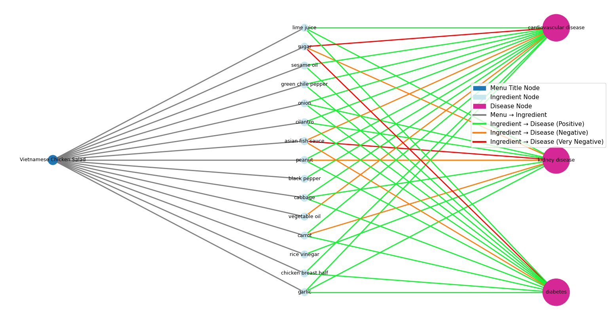
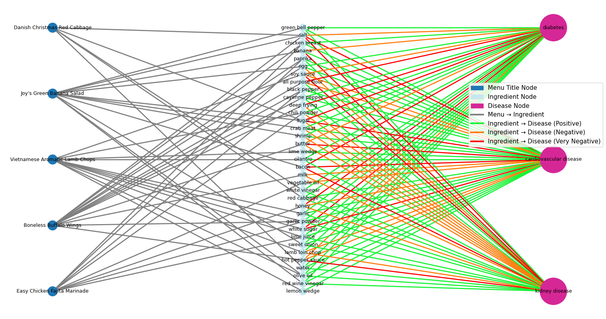

#For katherine 
##how to run:
type into terminal "python .\process_menu_ingredient.py"
will show graph if works
## Adding an image to this README

1. Put the image file in the repo (e.g., an `images/` folder or the same folder as this README).

2. Use one of these snippets where you want the image to appear:

- Markdown (local file):

- Markdown (if the filename contains spaces, URL‑encode spaces):

# Hello-World Repository

This repository contains materials and resources for the Python Fundamentals Tutorial Module, designed for high school students. It includes a comprehensive syllabus, lesson materials, exercises, projects, and additional resources to support learning Python and computer science fundamentals.

## Repository Structure

- `python-fundamentals-tutorial/` — Main course content and materials
- `README.md` — Overview of the repository (this file)

## Getting Started

1. Explore the `python-fundamentals-tutorial/` directory for the full curriculum.
2. Review the syllabus and follow the lessons in order.
3. Complete exercises and projects as you progress.

## Contributing

Contributions are welcome! Please fork the repository, create a feature branch, and submit a pull request with your improvements.

## License

This repository is for educational purposes. Please respect copyright and attribution requirements when using or sharing these materials.